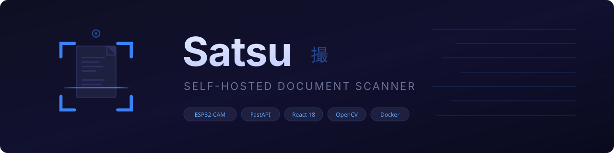
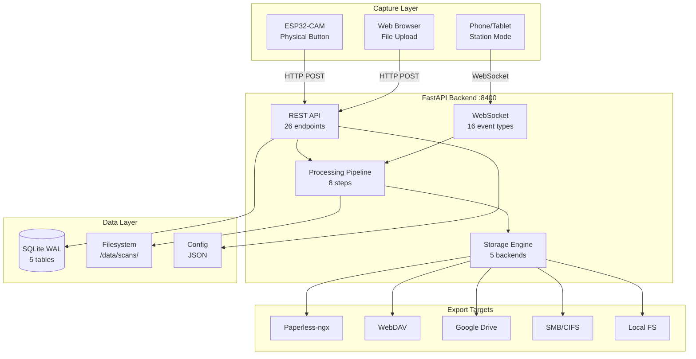
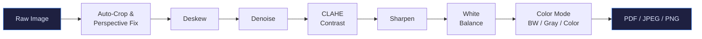
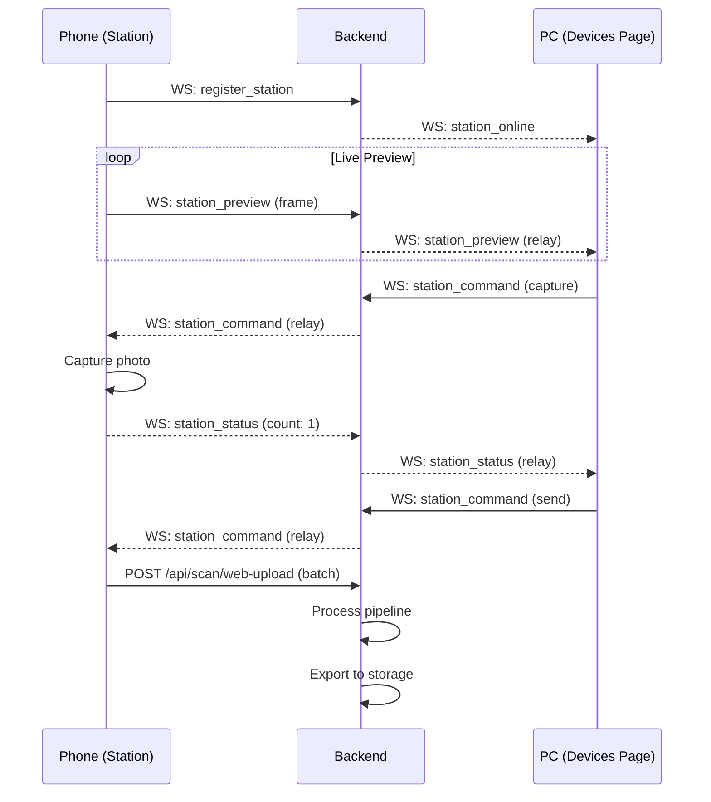

<div align="center">



[](https://python.org)
[](https://fastapi.tiangolo.com)
[](https://reactjs.org)
[](https://opencv.org)
[](#-quick-start)
[](LICENSE)

**[Quick Start](#-quick-start)** •
**[Features](#-features)** •
**[Architecture](#-architecture)** •
**[Configuration](#-configuration)** •
**[Screenshots](#-screenshots)**

</div>

---

## What is ESPScanCam?

ESPScanCam is a **self-hosted document scanning system** that turns an ESP32-CAM module or any phone/tablet into a dedicated scanner. Captured images go through an 8-step OpenCV processing pipeline and are exported to your storage of choice — Paperless-ngx, WebDAV, Google Drive, SMB, or local filesystem.

**Perfect for:**
- Homelab owners wanting a physical scan button on their desk
- Paperless-ngx users who need a cheap, dedicated scanner
- Anyone who wants a phone-based scanning station with remote control
- Self-hosters who refuse to depend on cloud scanning apps

> [!NOTE]
> **Vibe Coded Project** — This application was built using AI-assisted development with [Claude Code](https://claude.ai/code).

---

## Features

<table>
<tr>
<td width="33%" valign="top">

### Multi-Source Capture
**3 capture methods**
- **ESP32-CAM** — Physical button, auto-upload
- **Scanning Station** — Phone/tablet as kiosk scanner
- **Web Upload** — Drag & drop from browser

</td>
<td width="33%" valign="top">

### 8-Step Processing
**Fully configurable pipeline**
- Auto-crop & perspective correction
- Deskew (rotation fix)
- Denoise & sharpen
- CLAHE contrast enhancement
- White balance normalization
- Color / Grayscale / B&W modes

</td>
<td width="33%" valign="top">

### 5 Storage Backends
**Export anywhere**
- **Paperless-ngx** — Direct API upload
- **WebDAV** — Nextcloud, etc.
- **Google Drive** — Service account
- **SMB/CIFS** — Network shares
- **Local** — Filesystem copy

</td>
</tr>
</table>

### Scanning Station (Kiosk Mode)
- Open `/station` on a phone or tablet — it becomes a dedicated scanner
- **Remote control** from the Devices page: capture, torch, switch camera, send
- **Crop zone calibration** — Set it once, apply to all subsequent scans
- **Batch accumulation** — Capture multiple pages, review thumbnails, send as multi-page PDF

### Modern Web UI
- Mobile-first responsive (375px+)
- Dark theme with CSS custom properties
- Real-time updates via WebSocket (16 event types)
- Processing profiles — save and reuse parameter presets
- Scan history with search, pagination, bulk actions
- Interactive crop editor with drag-and-drop corners

### ESP32-CAM Firmware
- One-click web flashing from the browser (no toolchain needed)
- Non-blocking architecture (millis-based, no delay())
- LED feedback patterns for status indication
- Configurable resolution, JPEG quality, flash duration
- PSRAM frame buffer for high-res capture

---

## Quick Start

### Docker Compose (Recommended)

```yaml
services:
  espscancam:
    image: espscancam:latest
    container_name: espscancam
    ports:
      - "8400:8400"
    volumes:
      - espscancam-data:/data
    environment:
      - TZ=Europe/Paris
    restart: unless-stopped

volumes:
  espscancam-data:
```

```bash
docker compose up -d
```

**Access**: http://localhost:8400

### Docker Run

```bash
docker run -d \
  --name espscancam \
  -p 8400:8400 \
  -v espscancam-data:/data \
  -e TZ=Europe/Paris \
  espscancam:latest
```

### Build from Source

```bash
# Frontend
cd frontend && npm install && npm run build

# Backend
cd backend && pip install -r requirements.txt
ESPSCANCAM_DATA_DIR=/data uvicorn main:app --host 0.0.0.0 --port 8400
```

---

## Configuration

### Environment Variables

| Variable | Default | Description |
|----------|---------|-------------|
| `ESPSCANCAM_DATA_DIR` | `/data` | Persistent data directory |
| `ESPSCANCAM_PORT` | `8400` | Server port |
| `ESPSCANCAM_LOG_LEVEL` | `INFO` | Log level (DEBUG, INFO, WARNING, ERROR) |
| `TZ` | `UTC` | Container timezone |

### First Launch

1. **Open the web UI** — Navigate to `http://your-server:8400`
2. **Configure storage** — Settings page, add your Paperless-ngx / WebDAV / etc. credentials
3. **Flash an ESP32-CAM** (optional) — Devices page, click "Flash ESP" to program a board from the browser
4. **Or use Station mode** — Open `/station` on a phone, name it, and start scanning
5. **Scan!** — Captured documents are processed and exported automatically

### Storage Backend Setup

<details>
<summary><b>Paperless-ngx</b></summary>

1. Open Paperless-ngx admin, create an API token
2. In ESPScanCam Settings → Storage, select **Paperless-ngx**
3. Enter URL: `http://your-paperless:8000`
4. Enter API token
5. Click **Test Connection**

</details>

<details>
<summary><b>WebDAV (Nextcloud, etc.)</b></summary>

1. In ESPScanCam Settings → Storage, select **WebDAV**
2. Enter WebDAV URL (e.g. `https://nextcloud.example.com/remote.php/dav/files/user/Scans/`)
3. Enter username & password
4. Click **Test Connection**

</details>

<details>
<summary><b>Google Drive</b></summary>

1. Create a GCP service account with Drive API enabled
2. Download the JSON credentials file
3. In ESPScanCam Settings → Storage, select **Google Drive**
4. Paste the service account JSON
5. Specify the target folder ID

</details>

<details>
<summary><b>SMB/CIFS</b></summary>

1. In ESPScanCam Settings → Storage, select **SMB**
2. Enter server address, share name, path
3. Enter credentials (domain optional)
4. Click **Test Connection**

</details>

---

## Architecture

### System Overview



### Processing Pipeline



### Station Mode Flow



---

## Project Structure

```
espscancam/
├── esp32cam/                    # ESP32-CAM Arduino firmware
│   ├── espscancam.ino           # Main sketch
│   ├── config.example.h         # WiFi + server URL template
│   ├── led.h                    # LED patterns
│   └── buttons.h                # Button handlers
├── backend/
│   ├── main.py                  # FastAPI app, routes, WebSocket
│   ├── scanner.py               # 8-step OpenCV pipeline
│   ├── storage.py               # 5 storage backends
│   ├── database.py              # SQLite WAL, migrations
│   ├── config.py                # Config management
│   ├── models.py                # Pydantic v2 models
│   ├── logger.py                # Structured logging
│   └── requirements.txt         # Python deps (pinned)
├── frontend/
│   ├── src/
│   │   ├── pages/               # 9 pages (Dashboard → About)
│   │   ├── components/          # Shared + page-specific
│   │   ├── hooks/               # useWebSocket, useCamera, useStation
│   │   └── styles/              # CSS custom properties
│   ├── public/
│   │   ├── icons/               # SVG + PNG + ICO
│   │   └── manifest.json        # PWA manifest
│   └── vite.config.js
├── Dockerfile                   # Multi-stage (Node + Python)
├── docker-compose.yml
└── specs/                       # Design specs (speckit)
```

---

## Technology Stack

| Layer | Technologies |
|-------|-------------|
| **Capture** | ESP32-CAM (Arduino C++), Web Camera API, File Upload |
| **Backend** | Python 3.11, FastAPI, uvicorn, aiohttp, aiofiles, aiosqlite |
| **Processing** | OpenCV (headless), Pillow, NumPy |
| **Frontend** | React 18, Vite, CSS Custom Properties, WebSocket |
| **Database** | SQLite WAL mode (5 tables) |
| **Real-time** | Native WebSocket (no Socket.IO) |
| **Container** | Docker multi-stage, multi-arch (amd64/arm64) |

---

## Data & Backup

### Volumes

| Path | Content |
|------|---------|
| `/data/espscancam.db` | SQLite database (devices, batches, pages, logs, profiles) |
| `/data/config.json` | All settings and storage backend credentials |
| `/data/scans/` | Raw uploads and processed outputs |
| `/data/exports/` | Generated PDFs for export |

### Backup / Restore

Settings can be exported and imported from **Settings → Backup**. This includes all configuration, storage backends, and processing profiles.

---

## Development

```bash
# Backend
cd backend
python -m venv .venv && source .venv/bin/activate
pip install -r requirements.txt
ESPSCANCAM_DATA_DIR=/tmp/espscancam-data uvicorn main:app --reload --host 0.0.0.0 --port 8400

# Frontend (separate terminal)
cd frontend
npm install
npm run dev

# ESP32-CAM firmware
cd esp32cam
cp config.example.h config.h   # Edit WiFi + server URL
pio run --target upload
```

---

## Contributing

Contributions welcome!

1. Fork the repository
2. Create a feature branch
3. Submit a pull request

---

## License

MIT License — see [LICENSE](LICENSE) file for details.

---

<div align="center">

**Built with [Claude Code](https://claude.ai/code) for the self-hosting community**

</div>
